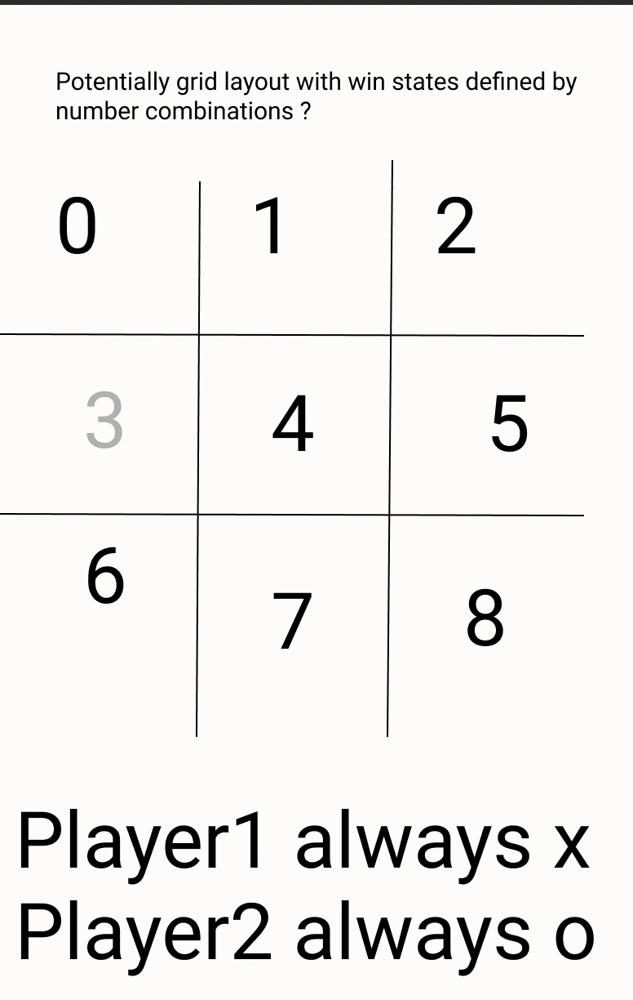

# tictactoe
General Assembly Project 1

First Project for GA Software Engineering Immersive - Flex.

## Link to page
[Tic-Tac-Toe](https://michaeljgrant.github.io/tictactoe/)


## Overview

This is the first project for the GA Software Engineering Immersive - It's aim is to create a Tic Tac Toe page and host it on the web using github pages. It is an independent project allowing flexibility of design, layout and choices of how it responds. This project was written in HTML, CSS and Javascript, using a gameboard that responds to clicks within the HTML document made by players and computer.

The computer written for this project is a simply random number generator and does not make comparisons to indexes to have a smarter AI. 

A smart AI may be added in future as an example to assist future students in developing similar projects.

This project was stylized using CSS grid to make it's appearance uniform across browsers. It is contained with a 300px width box so that it can be viewed on even the smallest screens with no UI issues.


## Mockups and win-states

First draft of gameboard layout


Win-states can be determined in single array
```
["", "", "", "", "", "", "", "", "", ]
``` 
Where indexes are positions on the board in mock-up.

All win state combinations:


```
horizontal: 
    [0,1,2], [3,4,5], [6,7,8]
vertical: 
    [0,3,6], [1,4,7], [2,5,8]
diagonal: 
    [0,4,8], [2,4,6]

```

